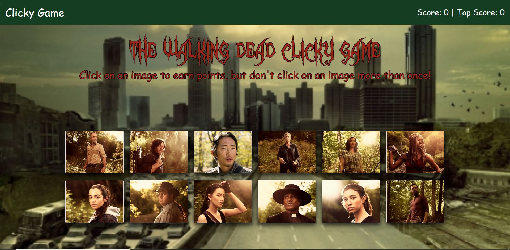

# Clicky-Game

## Overview

For this assignment, you'll create a memory game with React. This assignment will require you to break up your application's UI into components, manage component state, and respond to user events.

## Deployed Link

[https://vjcardoza2011.github.io/Clicky-Game/]

## Instructions

* There are 12 character cards of the Walking Dead cast displayed on the page. 
* The object of the game is to memorize the images and click each character without clicking the same character twice.
* If you click on the same character twice before finishing the game, the game will restart.
* The top score is the most characters you had without clicking twice.
* This top score will be kept until the page is refreshed.
* If you click on all 12 characters in a row, you win! VICTORY!!!
* Here's the tricky part though... the cards will shuffle on the page every time you click a card.
* ENJOY!

## DEMO

 